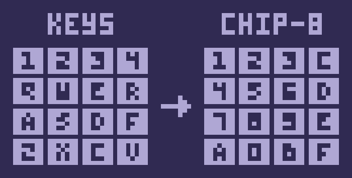

<a name="readme-top"></a>
<div align="center">
	<a href="./LICENSE">
		
	</a>
	<a href="https://github.com/LordOfTrident/trip-8/graphs/contributors">
		
	</a>
	<a href="https://github.com/LordOfTrident/trip-8/stargazers">
		
	</a>
	<a href="https://github.com/LordOfTrident/trip-8/issues">
		
	</a>
	<a href="https://github.com/LordOfTrident/trip-8/pulls">
		
	</a>
	<br><br><br>
	
	<h1 align="center">TRIP-8</h1>
	<p align="center">🔱 Trident's CHIP-8 emulator 👾</p>
	<p align="center">
		<a href="#games">Games</a>
		.
		<a href="#tests">Tests</a>
		.
		<a href="https://github.com/LordOfTrident/trip-8/issues">Report Bug</a>
		·
		<a href="https://github.com/LordOfTrident/trip-8/issues">Request Feature</a>
	</p>
	<br>
</div>

<details>
	<summary>Table of contents</summary>
	<ul>
		<li><a href="#introduction">Introduction</a></li>
		<li><a href="#features">Features</a></li>
		<li>
			<a href="#controls">Controls</a>
			<ul>
				<li><a href="#keypad">Keypad</a></li>
			</ul>
		</li>
		<li>
			<a href="#pre-requisites">Pre-requisites</a>
			<ul>
				<li><a href="#debian-linux">Debian Linux</a></li>
				<li><a href="#arch-linux">Arch Linux</a></li>
				<li><a href="#void-linux">Void Linux</a></li>
				<li><a href="#alpine-linux">Alpine Linux</a></li>
				<li><a href="#os-x">OS X</a></li>
			</ul>
		</li>
		<li><a href="#quickstart">Quickstart</a></li>
		<li><a href="#references">References</a></li>
		<li><a href="#bugs">Bugs</a></li>
	</ul>
</details>

## Introduction
**TRIP-8** is a [CHIP-8](https://en.wikipedia.org/wiki/CHIP-8) emulator written in
[C99](https://en.wikipedia.org/wiki/C99) using the [SDL2](https://www.libsdl.org/) library.

<div align="center">
	
</div>

## Features
- CPU cycle is 660Hz, but can be edited in [emulator.c](src/emulator.c) with the `CYCLE_MS` macro.
- Refresh rate is 60Hz (includes updating of timers), but can be edited in [emulator.c](src/emulator.c) with the `REFRESH_MS` macro.
- Window scale is 12 (768x384), but the window is resizable and the default scale can be edited in [emulator.c](src/emulator.c) with the `WINDOW_SCALE` macro.
- The compatibility is strictly CHIP-8 as described in the [flags](https://github.com/Timendus/chip8-test-suite#flags-test)
and [quirks](https://github.com/Timendus/chip8-test-suite#flags-test) tests of the
[CHIP-8 test suite](https://github.com/Timendus/chip8-test-suite). This compatibility choice breaks
some games, like Blinky.
- Uses a procedural sine wave sound for beep, which can be customized in [system_audio.c](src/system_audio.c).

## Controls

| Key    | Action               |
| ------ | -------------------- |
| Escape | Quit the emulator    |
| Return | Restart the emulator |

### Keypad
<div align="center">
	
</div>

Left, up, right and down arrow keys are mapped to CHIP-8 `4`, `2`, `6` and `8` keys respectively due
to being commonly used for 4-way movement. The numpad keys are mapped to the corresponding CHIP-8
number keys. Controls can be modified in [system_keyboard.c](src/system_keyboard.c).

## Pre-requisites
The following is required to compile the emulator:
- A C99 compiler
- Makefile
- [SDL2](https://github.com/libsdl-org/SDL)

### Debian Linux
```sh
$ apt install gcc make libsdl2-dev
```

### Arch Linux
```sh
$ pacman -S gcc make sdl2
```

### Void Linux
```sh
$ xbps-install gcc make SDL2-devel
```

### Alpine Linux
```sh
$ apk add gcc make sdl2
```

### OS X
```sh
$ brew install gcc make sdl2
```

## Quickstart
```sh
$ git clone https://github.com/LordOfTrident/trip-8
$ make release
$ ./trip8 roms/trip8.rom
```

You can find games and other roms in the [roms](roms/) folder and compatibility tests in the [tests](tests/) folder.

If you are on Linux (or a Unix OS), you can use `make install` to install the emulator into `/usr/bin/trip8`:
```sh
$ make install
$ trip8 roms/trip8.rom
```

## References
- https://en.wikipedia.org/wiki/CHIP-8#Opcode_table
- [Cowgod's CHIP-8 Technical Reference](res/cowgods-chip8-technical-reference.pdf)
- https://www.laurencescotford.net/2020/07/19/chip-8-on-the-cosmac-vip-drawing-sprites/
- [Blue monochrome color palette](https://lospec.com/palette-list/blue-monochrome-lcd)

## Bugs
If you find any bugs, please, [create an issue and report them](https://github.com/LordOfTrident/trip-8/issues).

<br>
<h1></h1>
<br>

<div align="center">
	<a href="https://en.wikipedia.org/wiki/C_(programming_language)">
		
	</a>
	<a href="https://www.libsdl.org/">
		
	</a>
	<p align="center">Made with ❤️ love</p>
</div>

<p align="right">(<a href="#readme-top">Back to top</a>)</p>
